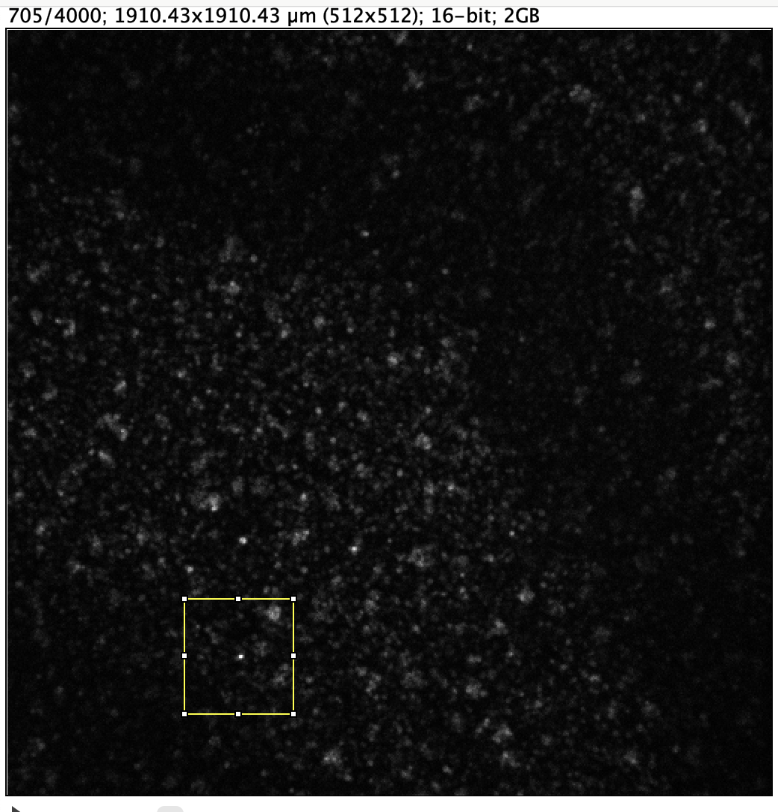
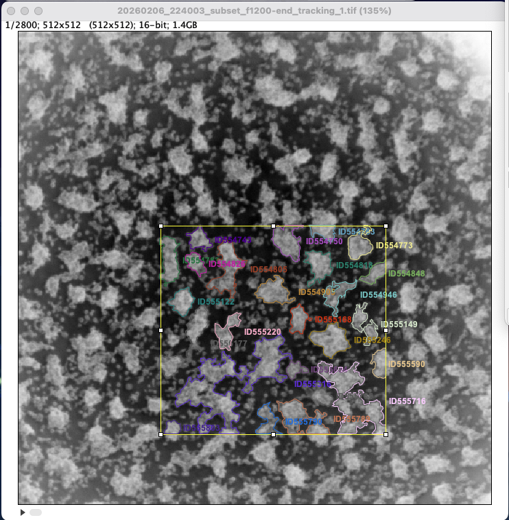
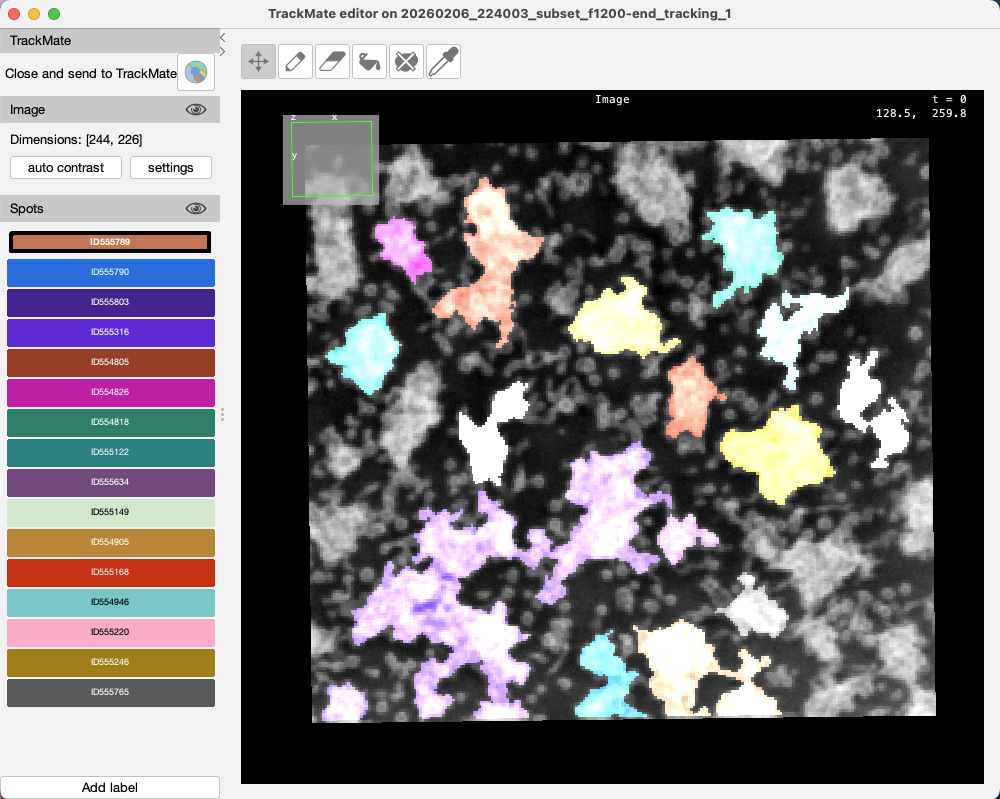
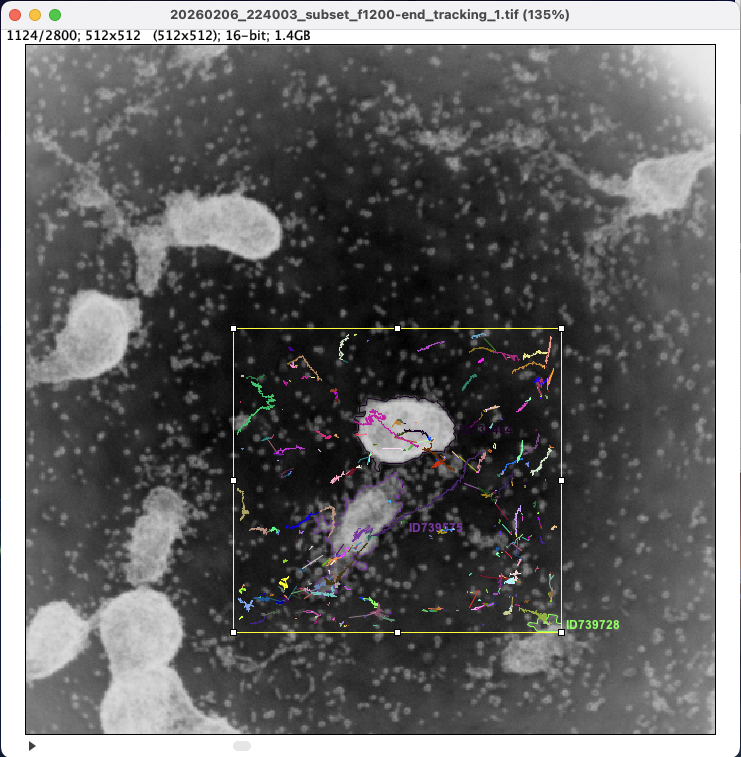
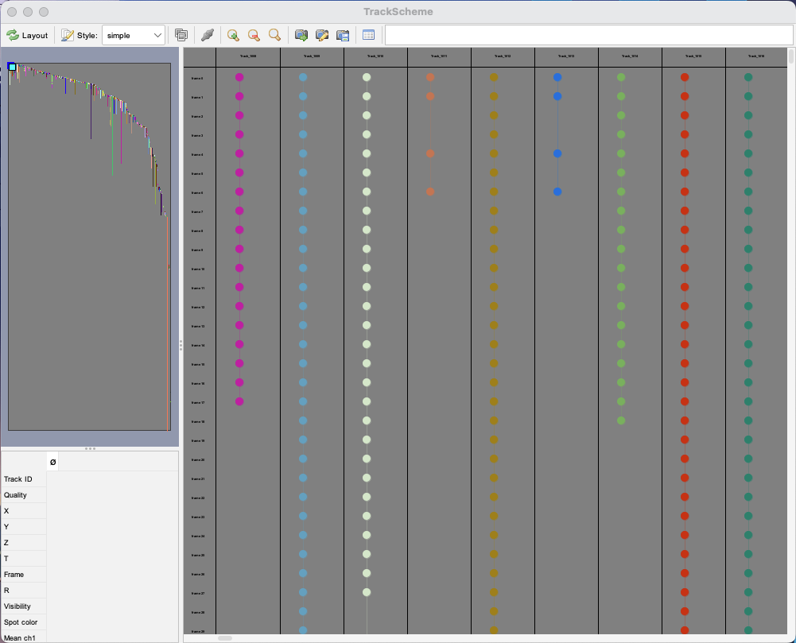
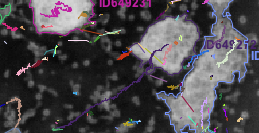

# Dictyostelium Motility and Cell Aggregation Under Starvation
Biophysics and Computer Vision Research Project under *Dr. Wouter-Jan Rappel* and *PhD Student Yi-Chieh Lai* at **UCSD Department of Physics**.

## Introduction

*Dictyostelium discoideum* is a social amoeba that, upon starvation, initiates a collective aggregation process to survive. Individual cells chemotax toward waves of cAMP, forming complex streaming patterns, mounds, and eventually a migrating multicellular slug. This process, regulated by **cAMP** signaling and cell adhesion, leads to the formation of a fruiting body.

## Idea

- Process TIFF file(s) from lab via thresholding.
- Each frame is 15 seconds.
- There are thousands of amoeba cells in movie, aggregating into 6 large cells by the end of the film.
- Use **ImageJ/Fiji's** built-in cell tracking algorithms (**TrackMate**) and libraries to model the position and velocity of a subset of these cells over time, particularly:
    - their movement *parallel/orthogonal to the Flamindo2 band*, and 
    - their movement *relative to each other*/cluster centers.

## Problems

The cells contain a fluorescent marker, called **Flamindo2**, which goes dark if the intracellular cAMP concentration is high. **Cyclic AMP (cAMP)** is the chemoattractant, in other words, the chemical the cells respond to under starvation. These waves of cyclic AMP sweep over the cells in a periodic fashion. Cells relay the chemoattractant signal: if they experience a high cyclic AMP concentration around their cell body, they begin to make cAMP and will secrete it, causing them to become **dark**.

The presence of this global wave/band of Flamindo2 moving from the top-right to the bottom-left of the (subset) of the Petri dish from the laboratory causes cells to move out of vision during thresholding, which poses a large challenge.

The **field of view is also much smaller** than the experimental Petri dish (cells may move out of frame), so **we do not know where these waves originate from**.

## Possible Solutions

Proposed by Dr. Rappel, we have the following solutions:

**1. Analyze a window/subset of the TIFF movie for a proof of concept**
- Even if it is for a few seconds, model the movement of the cells between the bands before the cells begin to disappear.
- Select a subset or a window of the TIFF movie;



**2. Persist the tracking of cells during disappearance if they have not moved too far**
- Keep tracking the cells' location when they have disappeared, freezing the tracker's position of the cell before it disappears, and continue tracking after it reappears.

# Overview (as of 02/07/2026)

Using the C1 movie (without waves), we have developed a preprocessing and tracking pipeline that produces improved tracking results by reducing noise and focusing on larger cell clusters.

### Processing Pipeline

The full process consists of five main steps:

1. **Pixel Inversion**: Invert the entire stack's pixels so cells appear light against a dark background, improving contrast for detection.

2. **Spatial and Temporal Windowing**: 
   - Select a spatial window from the stack
   - Filter frames to focus on aggregation periods (e.g., frames 1200-4000, where distinct clusters become clearer)

3. **Cell Detection via Thresholding**:
   - Use thresholding detector with simplified contours to detect each cell (intensity threshold: 17604)
   - Filter out groups with radius < 8 pixels to focus on larger clusters
   - This reduces tracking issues from small clusters that frequently disappear and reappear
   
   <p align="center">
     
     
   </p>

4. **Advanced Kalman Tracker (AKT)**:
   - Hyperparameters tuned for merging/splitting events:
     - Merging distance: 5
     - Splitting distance: 5
     - Kalman search radius: 30
     - Linking max distance: 30
     - Max frame gap: 3
   - Improved tracking stability: contours disappear less frequently, reducing "jumpy" tracks (straight lines jumping across frames)
   
   

5. **Track Analysis**: Generate tracking data including spots, tracks, edges, and branches (cell hierarchy) CSV files for further analysis.

### Current Issues and Limitations

1. **Inconsistent Splitting/Merging Events**: 
   - When two distinct cells merge, a new cell ID is assigned
   - These merged cells can split immediately after (due to contouring/threshold detection), creating new contours and IDs
   - This back-and-forth process is likely unavoidable given the ambiguous nature of the clusters

2. **Frame Gap Parameter Trade-offs**:
   - The max frame gap parameter requires careful tuning
   - Too low: causes disappearing/jumpy tracks and redundant cell IDs
   - Too high: risks incorrect linking of different nearby cells
   - Cells frequently disappear and reappear (visible in TrackScheme), requiring frame gap limits to maintain continuity
   
   

3. **Temporal Tracking Patterns**:
   - Early-middle frames: constant splitting/merging, unclear cluster identities (long horizontal curve in TrackScheme shows many cell IDs being created)
   - Later frames: tracking becomes more stable as clusters fully aggregate (curve dips, with long continuous tracks like the orange line representing the fully aggregated center cell)
   - This temporal pattern serves as a sanity check for the tracking quality

4. **Limited Split/Merge Detection**:
   - Analysis of `results/trial_3/..branches.csv` shows almost no successors or predecessors detected for most cells
   - Suggests that split/merge events may not be properly captured in the current implementation

### Results

Tracking results show promising signs of cell response to waves (e.g., a long purple track moving toward upper right), though further analysis is needed to confirm wave-velocity relationships.



**Output Data**: Tracking results (spots, tracks, edges, branches CSV files) are available in [`results/trial_3/`](results/trial_3).

**Video**: [Tracking visualization (frames 1200-4000 at 60 fps)](https://drive.google.com/file/d/163sUff1nipgEXZRfvcQ-P1H_oR9RZeLi/view?usp=sharing)

### Next Steps

- Develop strategy for extracting cluster center positions from tracking data
- Implement wave velocity calculation methodology
- Improve split/merge event detection and tracking consistency


## Particle/Cell Tracking Algorithms

A variety of tracking algorithms are available under ImageJ/Fiji's open-source TrackMate library. We are most interested in those that can detect and handle **merging and splitting events**, since our Dicty cells aggregate over time in a hierarchal fashion. The algorithms used to capture smaller cells merging to form larger cells can be found [here](docs/trackers)

Many of these algorithms include hyperparameters (i.e., radius, persistence, thresholds, pixels), that must be tuned to accurately capture frame-by-frame movement of cells.

Other available methods have been used, e.g., using contour detection via Python (cv2); however, there has been no success so far. There remain algorithms yet to have been attempted, such as YOLO by Ultralytics, which may provide tracking and plotting trajectories, but may need additional data preprocessing (format conversion, 16-bit support, performance optimization via 8-bit PNG frames) as well as post-training/fine-tuning with currently inaccessible data.

## Run

For image preprocessing utilities, use the following commands:

### preprocessor/window.py 
```bash
python -m preprocessor.window \
  --input path/to/movie.tif \
  --output path/to/window.tif \
  --start-frame 10 --end-frame 20 \
  --start-row 100 --end-row 300 \
  --start-col 150 --end-col 350
```

or force full load into RAM:
```bash
python -m preprocessor.window --input in.tif --output out.tif --no-memmap
```
